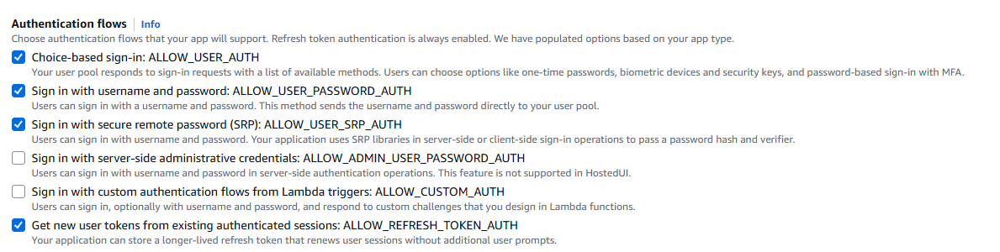
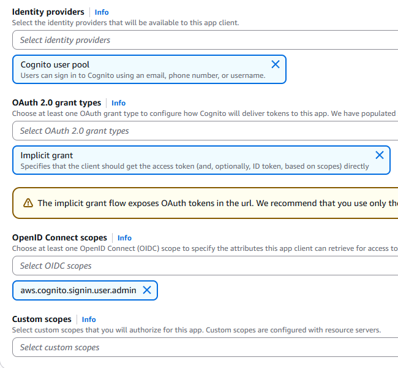
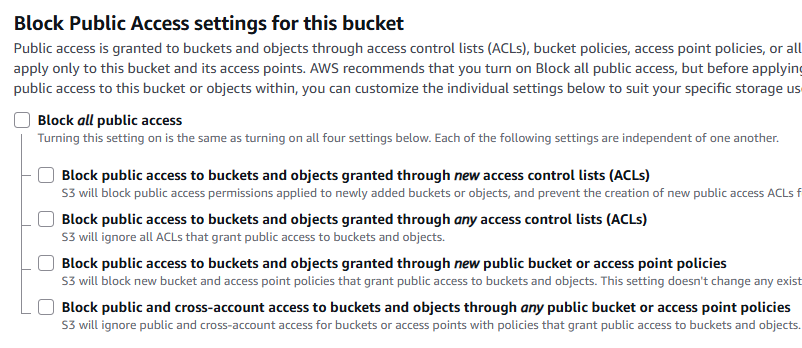

# Projekt autoryzacji i uwierzytelniania w AWS S3
## Implementacja w ograniczonym środowisku AWS Academy

### AWS
1. Utworzenie User Pool z parametrami:
    - Define your application: Traditional web application 
    - Configure options: Email
2. Utworzenie App Client dla user pool
    - App client > Edit
        <figure>
        <center></center>
        <figcaption>Grafika 1</figcaption>
        </figure>
    - App client > Login pages > Edit
        <figure>
        <center></center>
        <figcaption>Grafika 2</figcaption>
        </figure>
3. Utworzenie bucketu S3
    - Domyślne opcje oprócz Block public access
        <figure>
        <center></center>
        <figcaption>Grafika 3</figcaption>
        </figure>
    - Wgranie dowolnej grafiki (.png/.jpg)
4. Konfiguracja serwera
    - sklonowanie repozytorium
        ```sh
        git clone https://github.com/Spoky03/AWS_AiU
        npm install # instalacja zależności
        ```
    - utworzenie i wypełnienie pliku .env zgodnie z 
        ```sh
        AWS_REGION=us-east-1
        # na stronie uruchamiającej lab > AWS Details > AWS Cli
        AWS_ACCESS_KEY_ID=
        AWS_SECRET_ACCESS_KEY=

        S3_BUCKET_NAME=
        COGNITO_USER_POOL_ID=
        COGNITO_CLIENT_ID=
        COGNITO_CLIENT_SECRET=
        PORT=3000
        ```
    - wypełnienie `~/.aws/credentials`
        ```sh
        [default]
        aws_access_key_id=
        aws_secret_access_key=
        aws_session_token=
        ```
    - uruchom serwer deweloperski
        ```sh
        npm run dev
        ```
5. Test
    - W app client kliknij `View login page`
    - Utwórz użytkownika
    - Potwierdź email
    - Zaloguj się
    - Po zalogowaniu powinna wyświetlić się domyślna strona sygnalizująca o pomyślnym zalogowaniu
    - Adres url powinien zawierać parametr `access_token`, skopiuj go
    - Wyślij request 
        ```sh
        curl -X GET "http://localhost:3000/download-url?key=<nazwa_twojego_pliku>.png" \
        -H "Authorization: Bearer <access_token>"
        ```
    - Jako odpowiedź dostaniesz pre-signed url z twoim obrazem

<b>Sygnalizuje to, że aplikacja działa poprawnie.</b>


# 📘 API Dokumentacja 
## Uwierzytelnianie

Wszystkie endpointy wymagają tokena `access_token` w nagłówku `Authorization`:


Token powinien pochodzić z Amazon Cognito Hosted UI

---

## `GET /download-url`

### Opis
Generuje tymczasowy podpisany URL do pobrania pliku z AWS S3.

### Nagłówki

| Nazwa          | Wartość przykładowa            |
|----------------|---------------------------------|
| Authorization  | `Bearer <access_token>`         |

### Parametry zapytania (`query`)

| Nazwa  | Typ    | Wymagany | Opis                          |
|--------|--------|----------|-------------------------------|
| key    | string | ✅ tak    | Ścieżka/klucz pliku w S3      |

### Przykład żądania
```sh
GET /download-url?key=images/user123/1717000000.png
Authorization: Bearer eyJraWQiOiJ...
```
### Przykład odpowiedzi
```json
{
  "url": "https://twój-bucket.s3.amazonaws.com/images/user123/1717000000.png?AWSAccessKeyId=...&Expires=...&Signature=..."
}
```

## POST /upload-image

### Opis
Przesyła obraz do bucketa S3 (akceptowane tylko pliki graficzne). Plik zostaje zapisany pod ścieżką `images/<userId>/<timestamp>.<ext>`.

### Nagłówki

| Nagłówek        | Wartość przykładowa            |
|-----------------|---------------------------------|
| Authorization   | Bearer `<access_token>`         |
| Content-Type    | multipart/form-data             |

### Body (`multipart/form-data`)

| Pole   | Typ     | Wymagany | Opis                              |
|--------|---------|----------|-----------------------------------|
| image  | Plik    | ✅ tak    | Plik graficzny PNG, JPG, itp.     |

### Przykład w Postmanie
- Metoda: `POST`
- URL: `http://localhost:3000/upload-image`
- Authorization: `Bearer <access_token>`
- Body:
  - Typ: `form-data`
  - Klucz: `image` (Typ: File)
  - Wartość: wybierz plik graficzny (np. `logo.png`)

### Przykład odpowiedzi
```json
{
  "message": "Plik został przesłany pomyślnie.",
  "key": "images/abc123/1717000000.png",
  "location": "https://twój-bucket.s3.amazonaws.com/images/abc123/1717000000.png",
  "etag": "\"abcd1234efgh5678\""
}
```

## DELETE /delete-file

### Opis
Usuwa wskazany plik z bucketa S3. Dodatkowo sprawdzane jest, czy użytkownik jest właścicielem pliku (czy ścieżka zaczyna się od `images/<userId>/`).

### Nagłówki

| Nagłówek        | Wartość przykładowa            |
|-----------------|---------------------------------|
| Authorization   | Bearer `<access_token>`         |

### Parametry zapytania (Query)

| Parametr | Typ     | Wymagany | Opis                                    |
|----------|---------|----------|-----------------------------------------|
| key      | string  | ✅ tak    | Klucz (ścieżka) pliku do usunięcia w S3 |

### Przykład zapytania

```sh
DELETE http://localhost:3000/delete-file?key=images/abc123/1717000000.png
Authorization: Bearer eyJraWQiOiJ...
```
### Przykład odpowiedzi

```json
{
  "message": "Plik został usunięty pomyślnie.",
  "key": "images/abc123/1717000000.png",
  "deleted": true
}
```

## GET /list-files

### Opis
Zwraca listę plików przesłanych przez aktualnie uwierzytelnionego użytkownika do S3. Pliki są filtrowane po prefiksie `images/<userId>/`.

### Nagłówki

| Nagłówek        | Wartość przykładowa            |
|-----------------|---------------------------------|
| Authorization   | Bearer `<access_token>`         |

### Parametry zapytania

Brak

### Przykład zapytania

```sh
GET http://localhost:3000/list-files
Authorization: Bearer eyJraWQiOiJ...
```

### Przykład odpowiedzi

```json
{
  "message": "Lista plików pobrana pomyślnie.",
  "userId": "abc123",
  "totalFiles": 2,
  "files": [
    {
      "key": "images/abc123/1717000000.png",
      "size": 34567,
      "lastModified": "2024-05-29T11:25:43.000Z",
      "etag": "\"abcdef1234567890\"",
      "filename": "1717000000.png"
    },
    {
      "key": "images/abc123/1717001234.jpg",
      "size": 12345,
      "lastModified": "2024-05-29T11:30:01.000Z",
      "etag": "\"1234abcd5678efgh\"",
      "filename": "1717001234.jpg"
    }
  ]
}
```